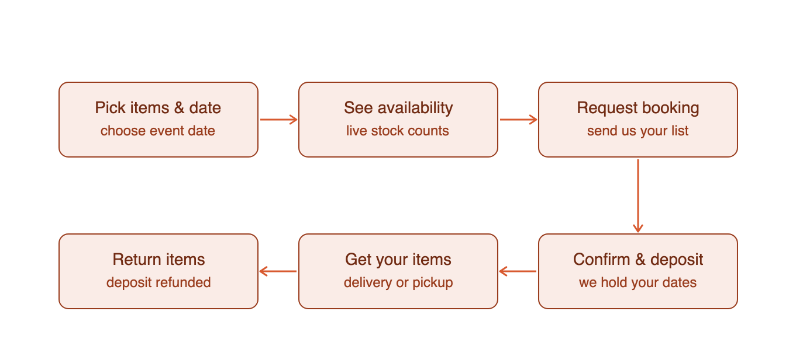
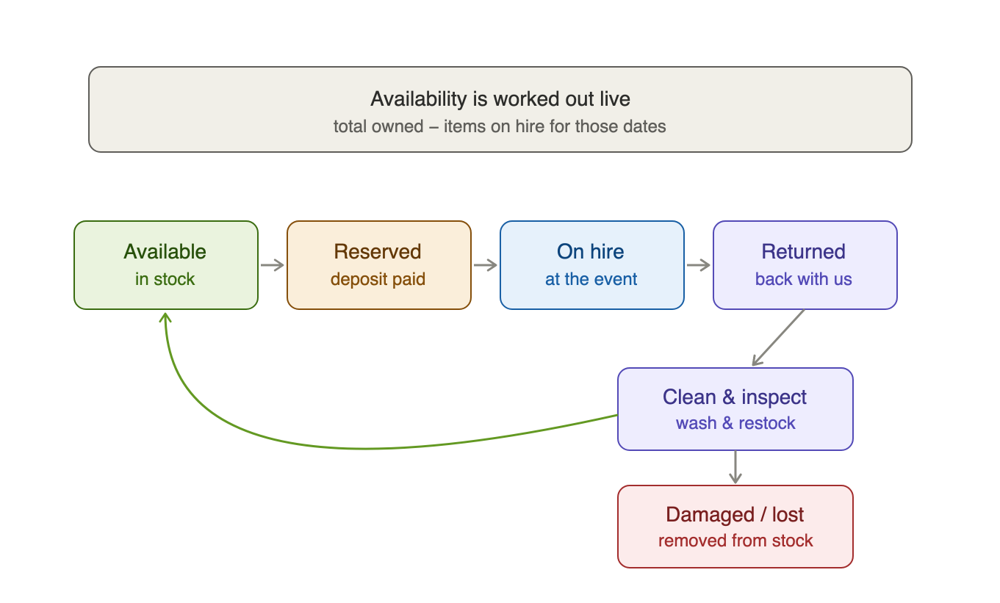

# KOK Kitchens — Equipment Hire: Inventory & Booking Design

**Prepared by:** Ophir Digital
**For:** KOK Kitchens
**Date:** 19 June 2026
**Status:** Built — MVP live (availability + soft‑hold bookings). Deposits deferred. See §9.

---

## 1. Purpose

This document captures the proposed design for turning the KOK Kitchens equipment‑hire
section from a simple **enquiry form** into a **live, inventory‑backed booking system** —
one that knows how much stock exists, shows customers what is actually available for their
event date, reduces availability automatically as bookings come in, and tracks items back
through return and restocking.

It records the two workflow diagrams (customer‑facing and behind‑the‑scenes), the data
model, the return/restock mechanism, the notification decision, and the build plan.

---

## 2. The customer journey

This is the flow a customer experiences. It is suitable to embed on the `/hire` page as a
simple "how hire works" section.



The journey deliberately **starts with the event date**. Hire availability only makes sense
against a date, so the date is collected before any stock is shown.

| Step | What the customer does | What happens behind the scenes |
| ------------------ | ---------------------------- | ------------------------------ |
| Pick items & date | Chooses items and an event date | — |
| See availability | Sees live "in stock / limited / fully booked" | Availability calculated for that date |
| Request booking | Submits their list | Booking saved as an enquiry / soft hold |
| Confirm & deposit | We confirm and request a deposit | Stock reserved against their dates |
| Get your items | Delivery or collection | Items marked "on hire" |
| Return items | Returns after the event | Deposit refunded; items restocked |

---

## 3. The inventory engine

This is the behind‑the‑scenes mechanism that answers the two key questions: *how is
availability deduced* and *what is the mechanism of return and restocking*.



### 3.1 How availability is deduced

The single most important point: **hire is date‑ranged**. Unlike the food menu (a simple
available / unavailable toggle), a hire item is not "gone" when booked — it is only
unavailable for events that **overlap** its hire window, then it returns to the pool.

So availability is never a single stock number; it is calculated **per requested date**:

```
shown to customer  =  total owned  −  units on hire whose dates overlap the customer's date
```

On the `/hire` page this surfaces as per‑item status — for example *"6 in stock"*,
*"only 2 left for your date"*, or *"fully booked — try another date"* — and the quantity
steppers are capped at what is actually available so customers cannot over‑book.

### 3.2 The return & restock lifecycle

Each unit cycles through the states shown in the diagram:

| State | Meaning | Consumes availability? |
| ----------------- | -------------------------------------- | ---------------------- |
| Available | In stock, ready to hire | No |
| Reserved | Deposit paid, dates held | Yes |
| On hire | Out with the customer at the event | Yes |
| Returned | Physically back with us | Yes (until restocked) |
| Clean & inspect | Being washed / checked / restocked | Yes (turnaround buffer) |
| Damaged / lost | Written off | No — permanently reduces total owned |

Two details matter:

- **Turnaround buffer** — an item stays unavailable for a day or two after return
  (washing and checking) before re‑entering the pool, so we never promise a Sunday item
  that is still dirty from Saturday.
- **Damaged / lost** is the *only* thing that shrinks real inventory — it permanently
  reduces `total_qty`. Everything else is a temporary hold that frees up again.

Restocking is therefore just a status change in admin ("mark returned" → "mark restocked"),
which automatically returns those units to the available pool for new bookings.

---

## 4. Current state vs. what this needs

| Area | Today | Needed for live inventory |
| ---------------- | ------------------------------- | --------------------------- |
| Catalogue | Static price list (`lib/hire-data.ts`) | Same list + a stock count per item |
| Stock | None | `hire_inventory` table |
| Bookings | Not saved — emailed only (`/api/hire-enquiry`) | `hire_bookings` table with dates + status |
| Availability | Not shown | Calculated live per date |
| Returns | Manual / informal | Status workflow in admin |
| Database | Neon Postgres already in use (`lib/db.ts`) | Add two tables alongside `orders` |

---

## 5. Proposed data model

Two new tables in the existing Neon Postgres database.

**`hire_inventory`** — how many of each item KOK owns.

| Column | Type | Notes |
| ----------------- | ----------------- | -------------------------------- |
| item_id | TEXT (PK) | Matches an id in `hire-data.ts` |
| total_qty | INTEGER | Units owned (reduced only by write‑offs) |
| updated_at | TIMESTAMPTZ | — |

**`hire_bookings`** — a saved booking and its lifecycle.

| Column | Type | Notes |
| ----------------------------- | ------------ | -------------------------------- |
| ref | TEXT | e.g. `HIRE‑AB123` |
| customer_name / phone / email | TEXT | Contact details |
| hire_out_date | DATE | When items go out |
| return_date | DATE | When items come back |
| items | JSONB | `[{ item_id, quantity }]` |
| status | TEXT | enquiry → confirmed → out → returned → closed (or cancelled) |
| deposit | NUMERIC | Optional |
| created_at | TIMESTAMPTZ | — |

Availability for a date = `total_qty` − the summed quantities of bookings whose
`[hire_out_date, return_date + buffer]` window overlaps the requested window and whose
status is one that holds stock (reserved / out / returned‑not‑yet‑restocked).

---

## 6. Notifications (ntfy) — recommendation

Hire enquiries currently fire to the **same** ntfy topic as food orders
(`kok-kitchen-orders`, in `/api/hire-enquiry`).

**Recommendation: give hire its own topic** — `kok-kitchen-hire`, via a new
`NTFY_HIRE_TOPIC` environment variable.

- **Different cadence & urgency** — food orders are same‑day and time‑critical; hire is
  future‑dated event planning. Mixing them buries one stream in the other.
- **Different handler** — whoever manages logistics and stock can subscribe to hire alerts
  without the food‑order firehose, and mute either independently.
- **Low cost** — one environment variable and a one‑line code change. The only trade‑off is
  subscribing to two topics in the ntfy app.

This change is independent of the inventory build and can be made on its own.

---

## 7. Build plan (phased)

Phases 1–3 are **built and verified** in this release; phase 4 (deposits) is deferred.

1. ✅ **Database + availability API** — `hire_inventory` and `hire_bookings` tables, a
   `/api/hire-availability?date` endpoint, and persistence of enquiries as bookings.
2. ✅ **Customer `/hire` page** — an event‑date picker, live availability badges, and
   quantity steppers capped at available stock.
3. ✅ **Admin** — set/clear stock counts, view bookings, and change status
   (confirm → out → returned → closed / cancelled).
4. ⬜ **Deposits (optional, not in MVP)** — reuse the existing Stripe checkout
   infrastructure to take a deposit at booking and auto‑refund on return.

---

## 8. Decisions made

- **Soft hold** — a fresh enquiry places a **48‑hour soft hold** so two customers aren't both
  told "available" for the same date. The hold lapses automatically if not confirmed.
- **Turnaround buffer** — **1 day** after return before an item is available again.
- **Deposits** — **manual for now** (Stripe deposit collection deferred — see §7.4).
- **ntfy** — **split confirmed**: hire alerts go to `kok-kitchen-hire`.

---

## 9. Going live — your checklist

The hire MVP is built and verified. To switch it on:

1. **Run `GET /api/init` once** on the live site after this release deploys — it creates the
   two hire tables (idempotent; safe to re‑run).
2. **Set your stock counts** in Admin → **Hire stock**: enter how many of each item you own
   and press Save. Items left blank stay "unmanaged" — shown to customers without a stock cap,
   exactly as the page works today. Use **Clear** to stop managing an item.
3. **Subscribe to the `kok-kitchen-hire` ntfy topic** in your ntfy app so hire enquiries reach
   you separately from food orders.

Once stock is set, customers pick an event date on `/hire` and see live availability
("6 available", "Only 2 left", "Fully booked"), with quantities capped so they can't
over‑book. Each enquiry places a 48‑hour soft hold; in Admin → Hire stock you move it through
**confirmed → out → returned → closed** (or **cancelled**). Mark a booking **closed** once
items are cleaned and back in stock.

Not included in this MVP (can be added later): online **deposit** collection/refund via Stripe.
